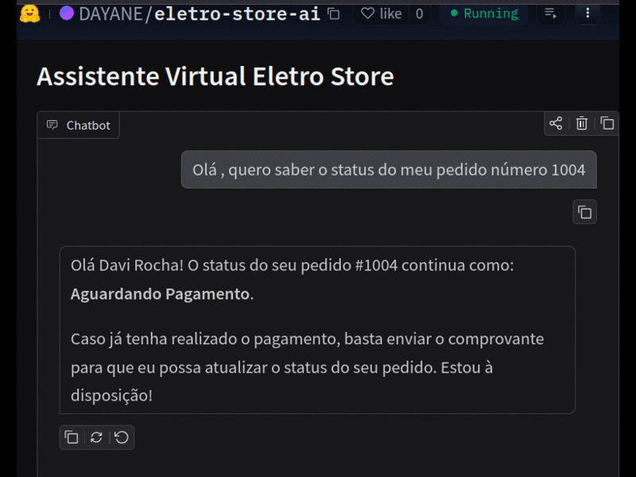

## 💡 Assistente Virtual com IA para Atendimento ao Cliente - Eletro Store

Este projeto é um **Assistente Virtual Inteligente** desenvolvido para simular o atendimento de uma loja de eletrônicos.


<p align="center">
  
</p>


Ele permite que clientes enviem mensagens e arquivos (como imagens ou comprovantes), e a aplicação utiliza **Inteligência Artificial** para entender o contexto e **executar ações automaticamente** de acordo com o contexto da interação.

---

## 🎯 O que este projeto faz?

Imagine um atendimento automático onde você pode:

* Perguntar sobre um pedido 📦
* Enviar um comprovante de pagamento 🧾
* Reclamar de um produto com defeito 🛠️

👉 O sistema entende sua solicitação e responde de forma inteligente,chamando funções internas.

---

## ⚙️ Funcionalidades

* 💬 Chat interativo com IA
* 📦 Consulta de status de pedidos
* 🎟️ Geração de cupons de desconto
* 🛠️ Registro de reclamações
* 📁 Processamento de arquivos enviados pelo usuário
* 📋 Informações sobre políticas da loja

---

## 🧠 Como funciona?

O sistema utiliza IA generativa (Gemini) para:

* Interpretar a mensagem do usuário
* Identificar a intenção
* Decidir qual ação executar

👉 Exemplo:

* Se o usuário envia um comprovante → o sistema pode atualizar o pedido
* Se o usuário reclama → o sistema registra a reclamação e pode gerar um cupom de desconto

---

## 🛠️ Tecnologias utilizadas

* 🐍 Python
* 🌐 Flask
* 🎛️ Gradio
* 🤖 IA Generativa (Gemini)

  
## 🏗️ Estrutura do Projeto
```
├── app.py              # Ponto de entrada (Flask + Gradio)
├── database.py         # Banco ficticio/ mock
├── services/           # Regras do "If Mágico",Configuração do Gemini e definições de funções       
├── utils/              # Processamento de arquivos (Imagens e PDFs)
├── requirements.txt    # Dependências do sistema
```


## 🚀 Como rodar o projeto

### 1️⃣ Clone o repositório

```bash
git clone https://github.com/seu-usuario/seu-repositorio.git
cd seu-repositorio
```

---

### 2️⃣ Crie e ative um ambiente virtual

```bash
pyenv virtualenv 3.13.0 eletro_store_ai_agent
pyenv activate eletro_store_ai_agent
```

---

### 3️⃣ Instale as dependências

```bash
pip install -r requirements.txt
```

---

### 4️⃣ Configure a chave da API

Para garantir a segurança, configure localmente a chave da sua API, não coloque  no arquivo .env.

```
GEMINI_API_KEY=sua_chave_aqui
```

---

### 5️⃣ Execute a aplicação

```bash
python app.py
```

---

### 6️⃣ Acesse no navegador

```
http://127.0.0.1:7860
```

---

## 🧪 Exemplos de uso

Você pode testar com mensagens como:

* "Qual o status do meu pedido 123?"
* "Segue meu comprovante de pagamento"
* "Meu produto veio com defeito"

---

## 📌 Status do projeto

🚧 Este é um MVP (Minimum Viable Product)

O projeto será evoluído com melhorias como:

* Otimização de tempo de resposta
* Melhor tomada de decisão com IA
* Expansão das funcionalidades

---

🚧 Próximos Passos:

Implementar Banco de Dados (PostgreSQL/Supabase) para persistência de pedidos.

Adicionar Testes Unitários (Pytest) para as funções de cupom e reclamação.

Containerização da aplicação com Docker para deploy em nuvem (GCP).


## 🔗 Link do projeto

https://github.com/DAYANE1130/eletro-store-ai-agent/tree/eletro-store-ai


## 🔗 Link do Hugging Face

https://huggingface.co/spaces/DAYANE/eletro-store-ai

---

## 🤝 Contribuição

Sinta-se à vontade para sugerir melhorias.


